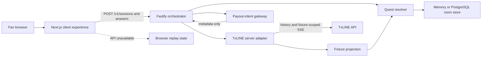
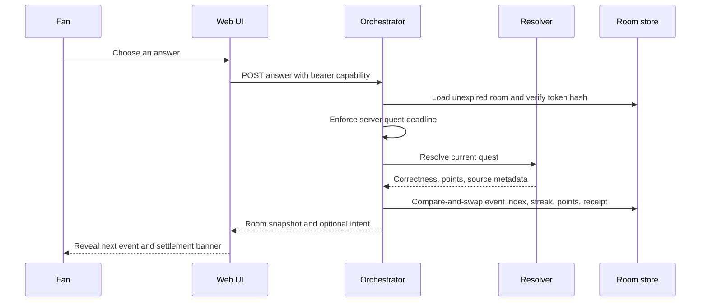

# Architecture

CrowdQuest is a two-process TypeScript application: a browser product built with Next.js/vinext and an optional Node.js orchestrator built with Fastify. Replay mode remains usable without the orchestrator, which makes the demo resilient but also creates two distinct execution paths.

## System shape

This diagram describes component boundaries, not a claim that an external connection is active. At runtime, `/v1/source` is the source of truth for whether the TxLINE adapter is connected or replaying.

## Frontend

`app/components/match-room.tsx` owns the interactive experience. It renders match state from `lib/demo-data.ts`, creates a guest API session on mount, and sends answers to the orchestrator when available. If any API call fails, the component marks the API unavailable and advances the same deterministic loop in browser state.

The frontend has two routes:

- `/` — match room and the Receipts & controls view
- `/design-system` — foundations, primitives, product states, and design influences

The frontend build uses vinext, Vite, and the Cloudflare Vite plugin. `.openai/hosting.json` currently declares no D1 or R2 binding. Generated `dist/` output is not an architectural source of truth.

## Orchestrator

`services/orchestrator/src/app.ts` composes five boundaries; `index.ts` only boots the listener and coordinates shutdown:

1. **HTTP API:** Fastify routes and response headers.
2. **Room domain:** fixture, event, quest, answer, source, and snapshot types.
3. **Resolution:** deterministic quest facts projected from normalized TxLINE history/SSE, with disclosed replay fallback when evidence is absent.
4. **Persistence:** `MemoryRoomStore` or `PostgresRoomStore`.
5. **External boundaries:** `TxLineClient` for match data and `PayoutGateway` for intent metadata.

The service validates request bodies with Zod, limits bodies to 16 KiB, uses an exact CORS allowlist, and rate-limits both the global API and session creation. Creating a room returns a random bearer capability once; only its SHA-256 hash is stored. All room operations require that capability and return the same not-found response for an unknown, expired, or wrongly owned room.

### API surface

| Method | Route | Purpose |
| --- | --- | --- |
| `GET` | `/healthz` | Service health and whether a TxLINE token is configured |
| `GET` | `/v1/source` | Connected/replay source status |
| `POST` | `/v1/sessions` | Create a guest room session |
| `GET` | `/v1/rooms/:sessionId` | Read a room snapshot |
| `POST` | `/v1/rooms/:sessionId/answers` | Validate and settle the current answer |
| `POST` | `/v1/rooms/:sessionId/reset` | Reset the replay session |
| `POST` | `/v1/rooms/:sessionId/window` | Open a new server-timed answer window |
| `POST` | `/v1/admin/txline/refresh` | Token-protected historical normalization/refresh operation |

## Current answer flow

The resolver, rather than the client, is authoritative when the API is available. It binds every submission to the active `questId`, rejects stale or late submissions, and omits answer keys and token hashes from public room state. Optimistic version checks ensure simultaneous answers cannot both settle. The browser path exists only as a disclosed demonstrable fallback.

## State and persistence

A room stores the display name, replay/event cursor, points, streak, answer receipts, token hash, version, quest deadline, and expiry. PostgreSQL persists room state as JSONB plus indexed ownership/version/expiry columns in `crowdquest_room_sessions`. Startup migration is additive and expired or legacy tokenless sessions are purged. Without `DATABASE_URL`, sessions exist only in process memory and disappear on restart.

The frontend and orchestrator each contain presentation/replay fixtures. Any product extension should consolidate those definitions or generate the browser view from the room snapshot to prevent drift.

## Reward boundary

On completion, the orchestrator may create a deterministic payout-intent object. Amounts are clamped to `MAX_PAYOUT_USDC`. The gateway returns one of `disabled`, `test`, or `approval_required`; it does not sign, submit, persist, or reconcile a transaction and it does not call the configured Coinbase agent URL.

## Deployment topology

Production uses Caddy at the public origin, a loopback-only Compose gateway, web and orchestrator containers, and a private PostgreSQL network. Releases are immutable Git worktrees under `/opt/crowdquest-releases/<commit>` with `/opt/crowdquest-current` pointing to the active release. A systemd timer creates verified custom-format PostgreSQL backups; optional S3 upload provides the off-host copy.

- static/server-rendered web worker at the public origin;
- orchestrator behind `/v1` or at `NEXT_PUBLIC_CROWDQUEST_API_URL`;
- PostgreSQL reachable only from the orchestrator;
- TxLINE and future payout credentials stored only in server secrets.

If the web and API use different origins, configure the exact web origin in `CORS_ORIGINS`. A reverse proxy with same-origin `/v1` routing is simpler and reduces browser exposure.

## Known engineering gaps

- Guest capability ownership is not identity; there are no accounts, roles, or identity recovery.
- Rate limiting is instance-local and is not a full bot or fraud-risk system.
- No persistent append-only audit ledger; receipts live inside mutable room JSON.
- No production payout execution or reconciliation.
- No Solana validation-proof verification in the product.
- API integration tests cover ownership, expiry, CORS, rate limits, deadlines, and concurrent answers; committed browser automation is still absent.
- Replay definitions are duplicated between frontend and orchestrator.

These are explicit product boundaries. The deployed demonstration is production-operated, but it is not approved for real-money rewards.
