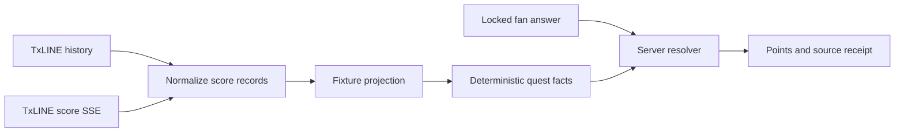

# TxLINE integration

CrowdQuest treats TxLINE as the authoritative match-data boundary when an activated server credential is present and the configured fixture produces enough normalized evidence. Without that evidence, the product stays playable in a clearly labeled deterministic replay. It never silently calls replay “live.”

## Runtime contract

`GET /v1/source` is the public truth for the active mode.

| Condition | `mode` | `connected` | Answer source |
| --- | --- | --- | --- |
| API token absent | `replay` | `false` | Authored fixture replay |
| Token rejected, upstream unavailable, or no usable fixture evidence | `replay` | `false` | Authored fixture replay |
| Auth succeeds and normalized fixture events resolve at least one quest | `live` | `true` | TxLINE-derived fixture projection |

The response also reports `normalizedEvents`, `authoritativeQuests`, and `streaming`. `streaming: true` means an authenticated SSE response is presently open; retrying or merely running a background loop does not count. “Configured” in `/healthz` only means a token exists; it is not a connectivity claim.

## Endpoints used

The server adapter uses these official TxLINE routes:

- `POST /auth/guest/start` — obtain the renewable guest JWT.
- `GET /api/fixtures/snapshot` — authenticate and check source reachability.
- `GET /api/scores/historical/{fixtureId}` — load the completed fixture event sequence used for judgeable replay settlement.
- `GET /api/odds/snapshot/{fixtureId}` — declared as the StablePrice snapshot boundary; the present UI uses authored display percentages and does not present them as fetched odds.
- `GET /api/scores/stream?fixtureId={fixtureId}` — consume fixture-scoped SSE updates and merge them into the normalized projection.
- `POST /api/token/activate` — exchange the confirmed on-chain free-tier subscription and wallet proof for the long-lived API token.

Both `Authorization: Bearer <guest JWT>` and `X-Api-Token` are sent from the orchestrator only. Neither credential reaches the browser.

## Authoritative resolution path



`normalizeScoreRecord` accepts only the configured fixture and reduces each upstream record to score, minute, action, sequence, and event kind. `projectFixture` then derives the five demonstration facts from the ordered event sequence:

1. whether the penalty changed the score;
2. whether either side scored before half-time;
3. the first-goal minute;
4. the time between the first and second goals;
5. the final score margin.

`POST /v1/rooms/{sessionId}/answers` asks the projection for the active quest’s answer key. A sufficient projection records `source: "txline"` and the observed TxLINE sequence. Missing evidence records `source: "replay"` and stays disclosed as replay. The public room schema deliberately omits `correctChoice`.

## Free-tier activation

TxLINE’s free tier still requires a Solana devnet transaction for account rent and network fees. The repository includes a safety-constrained activation utility at `tools/txline/activate-devnet.mjs`. It:

- pins the official TxLINE devnet IDL to a reviewed Git commit and SHA-256 hash;
- verifies the Solana devnet genesis hash, program address, and token mint;
- reads the on-chain pricing matrix and refuses to continue unless service level 1 costs zero provider tokens;
- allowlists transaction program IDs;
- signs the documented `${txSig}::${jwt}` activation message;
- verifies the issued token against fixture `18209181`;
- writes the token to a new mode-0600 file without printing it.

Run after funding a dedicated wallet with at least 0.005 devnet SOL through an official Solana method:

```bash
npm ci --prefix tools/txline
TXLINE_WALLET_PATH=/absolute/path/to/devnet-wallet.json \
TXLINE_OUTPUT_FILE=/absolute/private/path/txline.env \
npm --prefix tools/txline run activate
```

Never commit either file. Copy only the resulting API-token value into the deployment secret store.

## Proof boundary

TxLINE exposes statistic-validation proofs and on-chain validation instructions, but CrowdQuest does not currently request or verify those proofs. Its receipts are product decision receipts, not Solana proofs. Adding proof verification is a post-MVP hardening path and must not be claimed in the present submission.

## Firsthand integration feedback

Tested on July 12, 2026:

- Devnet guest auth returned HTTP 200 and a correctly shaped JWT response.
- The official OpenAPI document clearly specifies the two-header data-access model and the fixture filter on the scores stream.
- The runnable repository and IDL made the subscribe/activate signing payload unambiguous.
- Friction: the official public devnet airdrop returned rate-limit/internal errors from both the local development network and the supplied AWS host. The official `devnet-pow` utility also needs a small initial fee balance before it can mine a reward. This prevents fabricating a connected deployment and is why replay remains the honest default until the dedicated wallet is funded.
- Suggested improvement: offer a sponsor-funded hackathon activation transaction, a faucet reserve dedicated to the event, or a time-limited read-only token for teams whose only requirement is data ingestion.

## Official references

- [TxLINE quickstart](https://txline.txodds.com/documentation/quickstart)
- [World Cup free tier](https://txline.txodds.com/documentation/worldcup)
- [Streaming data](https://txline.txodds.com/documentation/examples/streaming-data)
- [On-chain validation](https://txline.txodds.com/documentation/examples/onchain-validation)
- [TxLINE OpenAPI document](https://txline.txodds.com/docs/docs.yaml)
- [Official on-chain examples](https://github.com/txodds/tx-on-chain)
